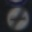

# **Traffic Sign Recognition** 

## Writeup

### Project completed by Gabe Johnson.

---

**Build a Traffic Sign Recognition Project**

The goals / steps of this project are the following:
* Load the data set
* Explore, summarize and visualize the data set
* Design, train and test a model architecture
* Use the model to make predictions on new images
* Analyze the softmax probabilities of the new images
* Visualize the feature maps within the neural network

[//]: # (Image References)

[image1]: ./ReferencePictures/TrainingDataHistogram.jpg "Train Data Histogram"
[image2]: ./ReferencePictures/DoubledTrainingDataHistogram.jpg "Doubled Train Data Histogram"
[image3]: ./NewPicturesFromInternet/NewWebSigns.png "New Signs from the Web"
[image4]: ./examples/placeholder.png "Traffic Sign 1"
[image5]: ./examples/placeholder.png "Traffic Sign 2"
[image6]: ./examples/placeholder.png "Traffic Sign 3"
[image7]: ./examples/placeholder.png "Traffic Sign 4"
[image8]: ./examples/placeholder.png "Traffic Sign 5"

---

### Data Set Summary & Exploration

I wrote a few lines of code to summarize statistics of the traffic signs data set:

* The size of training set is 34799
* The size of the validation set is 4410
* The size of test set is 12630
* The shape of a traffic sign image is (32,32,3)
* The number of unique classes/labels in the data set is 43

---

### Exploratory Visualization

Here is an example image from the data set:

Here is a histogram showing how many examples of each sign type are in the training data set:

![alt text][image1]

You can see that there are many images of some sign types and very few of others.  If there are few training examples for a particular sign type, the model will not have a good chance to learn it well.  So I decided to duplicate the pictures for each type with less than 500 images and add them back to the training set.  But before I added them back in, I used an affine transformation to slightly zoom in on each image while keeping their dimensions the same.  I did this transormation to introduce some variability into the training set.

Here is a picture of an original image and a zoomed-in image:

After doubling the images for the sign types with less than 500 examples, I examined the histogram again:

![alt text][image2]

---

### Design and Test a Model Architecture

*Pre-Processing*
I examined several methods of preprocessing the data.  I tried RGB images, HSV images, grayscale images, and single channel Hue images.  I achieved the highest training accuracy using RGB images, followed closely by grayscale images.  The accuracy of HSV images was not far behind that, followed by single channel Hue images.
I also scaled the pixel values to between -1 and 1 so that when I gave my model initial random weights and biases distributed closely around 0, the data values would be small enough to be meaningfully affected and avoid unbalanced effects typical within a large range of data values.

*Model Architecture*
My model is loosely based on the famous LeNet architecture.  Here is a summary:

| Layer         		|     Description	        					| 
|:---------------------:|:---------------------------------------------:| 
| Input         		| 32x32x3 RGB image   							| 
| Convolution 5x5     	| 1x1 stride, valid padding, outputs 28x28x18 	|
| RELU					|												|
| Max pooling	      	| 2x2 stride,  outputs 14x14x18 				|
| Convolution 5x5	    | 1x1 stride, valid padding, outputs 10x10x32   |
| RELU          		|           									|
| Dropout				|            									|
| Max pooling			| 2x2 stride, outputs 5x5x32					|
| Flatten				| Output 800									|
| Fully connected		| Output 120  									|
| RELU  				|           									|
| Dropout				|												|
| Fully connected		| Output 84										|
| RELU          		|           									|
| Dropout				|           									|
| Fully connected		| Output 43										|

Dropout layers were added to reduce unbalanced dependency on any given weight or bias.  The model was optimized for backpropogation using Adam Optimizer with a learning rate of 0.001 over 11 Epochs using a batch size of 275.  The layer dimensions and hyperparameters were adjusted one at a time using trial and error.  The number of epochs was chosen by observing when the accuracy starts to level off without letting it go too long, which would lead to overfitting.  An accuracy of 0.96 was achieved on the validation set, indicating a reliable model.

---

### Test the Model on New Images

I downloaded a chart of German traffic signs from this website:  https://www.howtogermany.com/images/roadsigns1.jpg, cropped, resized, and pre-processed eight of them.  These are the ones I chose:

![alt text][image3]

Then I ran them through the model and examined the predictions.  I then retrieved the top 5 scores the model came up with and their corresponding labels.  

Here are the results of the prediction:

| Image			        |     Prediction	        					| 
|:---------------------:|:---------------------------------------------:| 
| Stop Sign      		| Stop sign   									| 
| Road Narrows On Right	| Road Narrows On Right							|
| Yield					| Bumpy Road									|
| Ahead Only			| Ahead Only									|
| No Vehicles      		| No Vehicles					 				|
| Keep Left 			| Keep Left         							|
| Turn Left Ahead 		| Turn Left Ahead				 				|
| Bumpy Road 			| Roundabout Mandatory         							|

The prediction accuracy was 75%.  
The model decisively identified the Stop sign as seen because it predicted the Stop sign label with a value of 21.18, while the next highest prediction score was 8.44 for the No Entry sign.  
Although the second image was properly identified as Road Narrows On Right, it was not decisive, as shown because the correct label was predicted with a score of 42.21 while the next closest prediction (General Caution sign) was not far off at a score of 40.12.  This makes sense because these two types of signs have a lot of similarities.
The Yield sign was improperly classified as a Bumpy Road sign, and the Bumpy Road sign was improperly classified as a Roundabout Mandatory sign, and in both these examples, the correct classification did not make it into the top 5 predicted classes, which indicates that the model is not well trained for this classification.

I then ran the provided test set of 12,630 images through the model, which achieved an accuracy of 0.94 on images that the model has never seen before.  Because this accuracy is similar to the validation accuracy, it indicates that the model is not underfit or overfit.

---

### Visualizing Inside the Neural Network

I used the provided function to visualize feature maps of the first and second layer of the neural network at two different weight sets on each.
It is interesting to observe what each feature map emphasizes as important traits.  The first neural network layer identifies quite a few characteristics, while the second neural network layer identifies fewer traits to filter out the less important traits.
